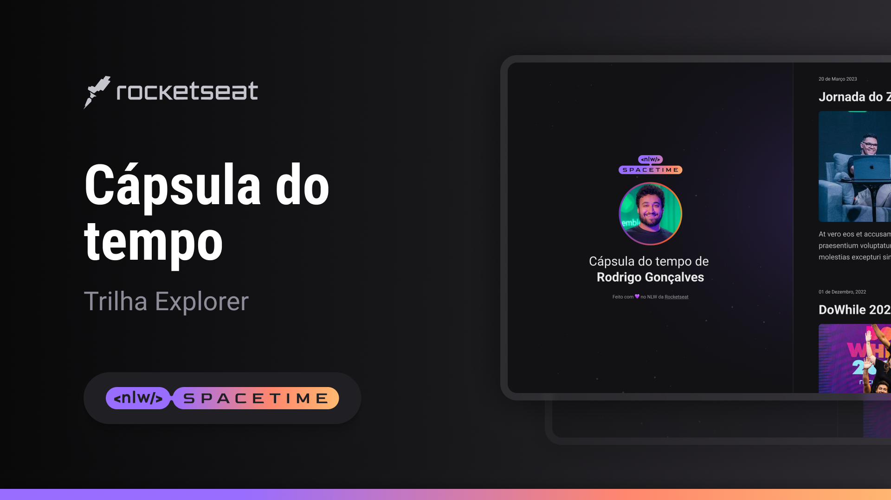

  

## 🖥️ Projeto
Esse é um projeto Web responsivo de uma cápsula do tempo para exibir memórias de uma linha do tempo.

## Tecnologias 🚀
Esse projeto foi desenvolvido durante o NLW da RocketSeat com as seguintes tecnologias:

- HTML
- CSS
- Git e Github

## Layout 🏷️
Você pode visualizar o layout do projeto através 
[desse link](https://www.figma.com/file/UKdDLUAHwO6UuGm2A0a3lQ/C%C3%A1psula-do-tempo-%E2%80%A2-Trilha-Explorer-(Community)?type=design&node-id=306%3A3&t=ogBXgSSYmgdc3a7f-1).
É necessário ter uma conta no [Figma](https://www.figma.com)